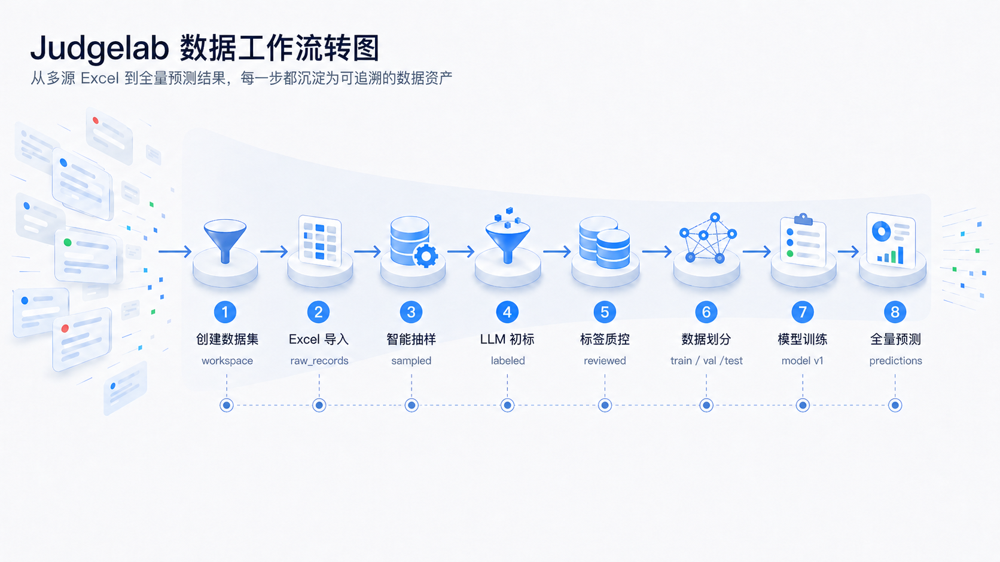

# BigSample JudgeLab

面向非技术用户的大样本文本判定工具。

它把一套常见的数据处理流程放进了本地网页界面里：

`导入 Excel -> 抽样 -> LLM 标注 / 人工整理 -> 质检 -> 划分训练集 -> 训练模型 -> 批量预测`



## 这个项目适合谁

- 手里有很多 Excel 文本数据，需要先抽样、筛选、标注
- 希望用 LLM 先做一轮初判，再人工复核
- 后续想训练一个自己的二分类模型
- 不想自己写一堆脚本，想直接在本地页面里点操作

## 现在能做什么

- 创建和管理多个数据集
- 批量导入多个 Excel 文件
- 自动检查表头是否一致
- 将原始数据写入每个数据集独立的 DuckDB
- 预览数据，不一次性把全部内容塞进内存
- 随机抽样、分层抽样、关键词过滤抽样
- LLM 批量判定
- 标签分布、缺失标签、低置信度检查
- 训练/验证/测试集划分
- 使用 `hfl/chinese-macbert-base` 做二分类训练
- 用训练后的模型做批量预测

## 先看结论：怎么最快跑起来

下面这组命令按顺序执行，正常就能打开页面：

```bash
cd judgelab
python3.11 -m venv .venv
source .venv/bin/activate
python -m pip install -U pip
python -m pip install -r requirements.txt
streamlit run app.py
```

如果你想在 PyCharm 里直接点运行，并在 Run 窗口里看到启动日志，可以改用：

```bash
python run_judgelab.py
```

也支持指定端口和日志级别：

```bash
python run_judgelab.py --port 8502 --log-level debug
```

启动后浏览器会打开一个本地地址，通常是：

```text
http://localhost:8501
```

## 运行环境

建议：

- Python `3.10`、`3.11` 或 `3.12`
- macOS / Linux / Windows 都可以
- 首次训练模型时需要下载 HuggingFace 或 ModelScope 模型

不建议直接用 Python `3.13` 做完整安装，`torch` 兼容性容易踩坑。

## 第一步：安装

### 1）进入项目目录

```bash
cd judgelab
```

### 2）创建虚拟环境

macOS / Linux:

```bash
python3.11 -m venv .venv
source .venv/bin/activate
```

Windows PowerShell:

```powershell
py -3.11 -m venv .venv
.venv\Scripts\Activate.ps1
```

### 3）安装依赖

```bash
python -m pip install -U pip
python -m pip install -r requirements.txt
```

如果这里卡在 `torch`，先确认你不是 Python 3.13。

## 第二步：启动页面

```bash
streamlit run app.py
```

看到 `Local URL` 后，浏览器打开对应地址即可。

## 第三步：第一次实际使用

建议第一次按下面顺序操作。

### 1）新建数据集

左侧边栏点“新建数据集”，填写：

- 数据集名称
- 说明（可不填，但建议写清数据来源和用途）

### 2）导入 Excel

准备 Excel 时尽量满足这几点：

- 第一行必须是表头
- 多个文件的表头名称要一致
- 同名字段尽量统一写法，不要一会儿叫“摘要”，一会儿叫“内容摘要”

导入后，系统会把原始数据写进：

```text
judgelab_workspace/datasets/{dataset_id}/data.duckdb
```

### 3）做抽样

你可以按场景选：

- 随机抽样：先快速看整体数据
- 分层抽样：希望各标签/类别更均衡
- 关键词过滤抽样：只抽你关心的主题

### 4）做 LLM 标注

LLM 标注需要你自己准备 API Key。

页面里要填的核心项：

- `API Key`
- `API URL`
- `model`
- 要判定的文本列
- 系统 Prompt

默认 API 地址是：

```text
https://open.bigmodel.cn/api/paas/v4/chat/completions
```

默认模型是：

```text
glm-5.1
```

### 5）检查标签质量

至少看这几项：

- 标签分布是否极端失衡
- 是否有空标签
- 是否有明显错标
- 低置信度样本是否需要人工复核

### 6）划分训练集并训练模型

训练前先确认：

- 文本列选对了
- 标签列选对了
- 标签是明确二分类

默认基础模型：

```text
hfl/chinese-macbert-base
```

也可以填写：

- HuggingFace / ModelScope 模型名
- 本地模型目录路径

例如：

```text
/Users/mac/Documents/PycharmProjects/tools/low_eco_llm/base_bert_model
```

### 7）批量预测

训练完成后，可以对数据集做全量预测，并导出结果继续使用。

## 目录说明

你最需要知道的是这几个目录：

```text
judgelab/
  核心逻辑代码

tests/
  单元测试

assets/
  README 配图

judgelab_workspace/
  本地运行后产生的工作区数据

projects/
  本地实验产物、示例输出
```

其中：

- `judgelab/`、`tests/`、`assets/` 适合进 GitHub
- `judgelab_workspace/`、`projects/` 属于本地运行数据，不建议上传

## 测试

先激活虚拟环境，再执行：

```bash
python -m unittest discover -s tests
```

注意：测试依赖 `requirements.txt` 里的完整依赖。只装少量轻量包时，测试会失败。

## 常见问题

### 1）`ModuleNotFoundError: No module named 'streamlit'`

说明依赖没装全：

```bash
python -m pip install -r requirements.txt
```

### 2）`ModuleNotFoundError: No module named 'duckdb'`

同样是依赖未安装完整，重新执行：

```bash
python -m pip install -r requirements.txt
```

### 3）模型训练阶段下载很慢

这是正常情况，首次会下载基础模型。可以：

- 换网络环境
- 预先把模型下载到本地
- 在页面里直接填本地模型目录

### 4）Excel 导入失败

优先检查：

- 文件是不是 `.xlsx`
- 第一行是不是表头
- 多个文件字段名是不是完全一致
- 是否混入空白列、合并单元格或异常格式
